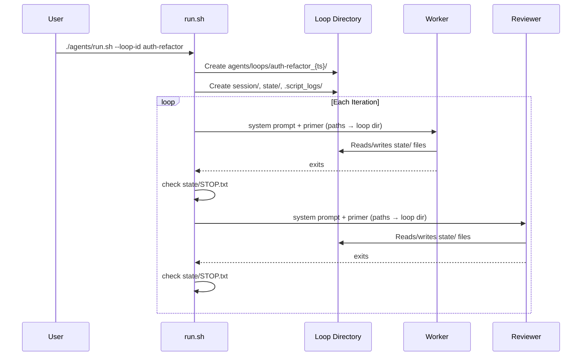
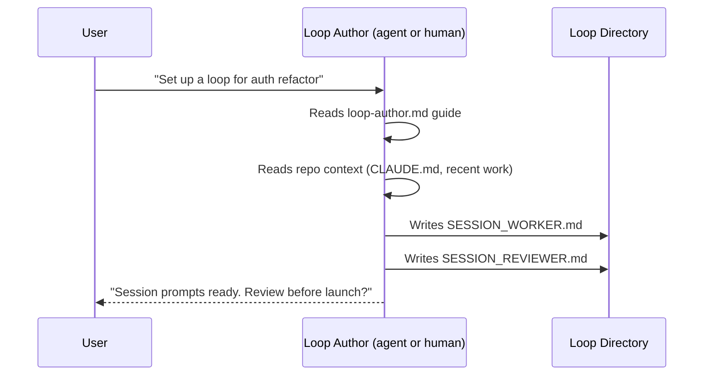
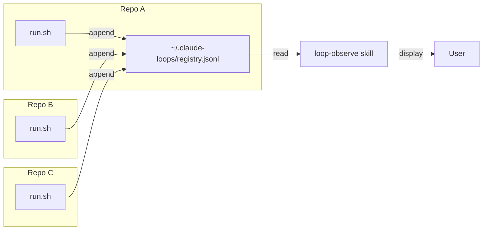
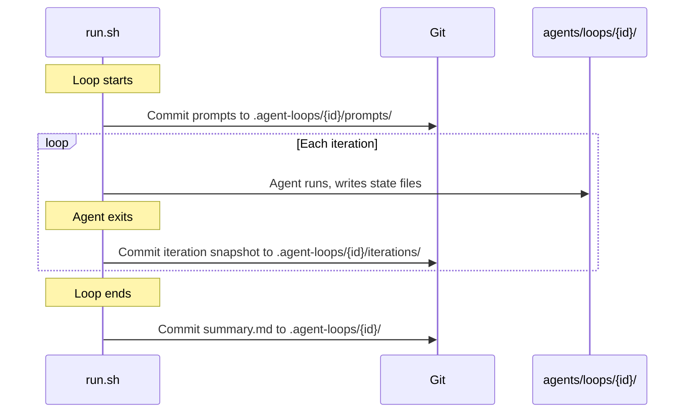
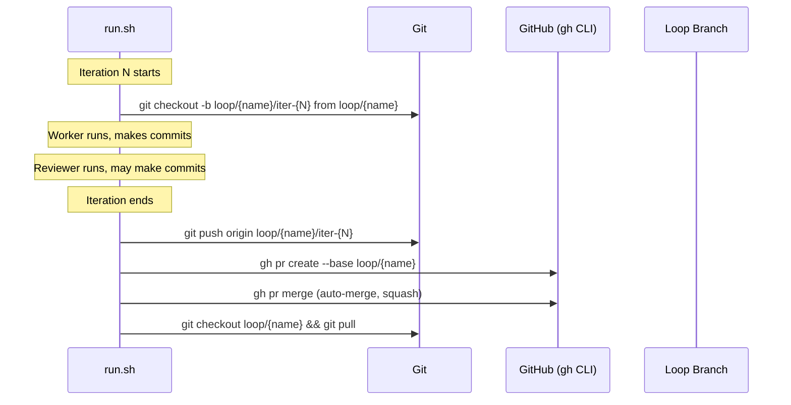
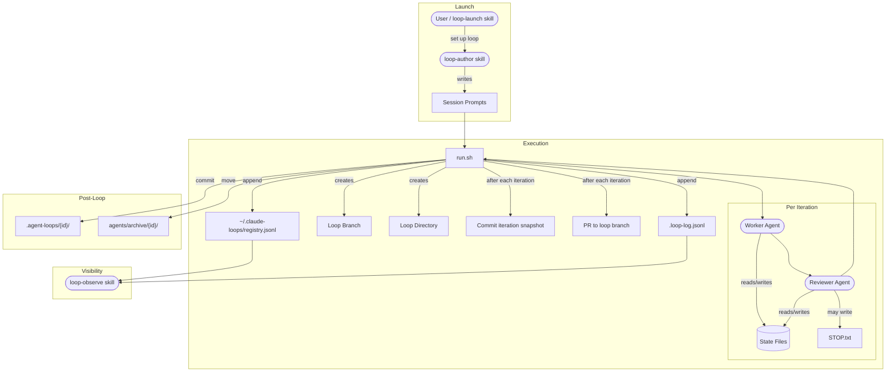
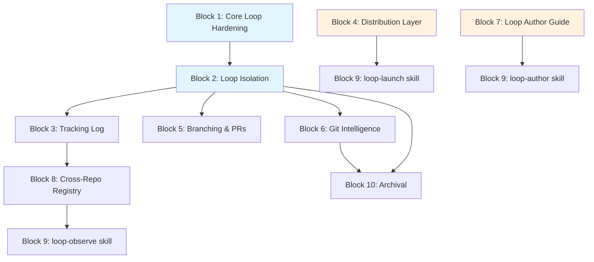

# Agent Loop Upgrade

The agent loop system (`agents-src/`) is a bash orchestrator that alternates worker and reviewer agents in a headless loop. It works, but it was built for one person running one loop at a time in one repo. The system now needs to support parallel loops, cross-repo visibility, better distribution, and richer observability — without losing the simplicity that makes it useful.

This plan covers architecture and behavior. It does not specify implementation details.

## Current System

```
┌──────────────────────────────────────────────────────────────┐
│                     claude-tooling repo                       │
│                                                              │
│  agents-src/                                                 │
│  ├── run.sh              ← bash orchestrator                 │
│  ├── stream-filter.jq    ← live output formatting            │
│  ├── READ_BEFORE_RESET.md                                    │
│  └── prompts/                                                │
│      ├── session.md      ← shared session control            │
│      ├── worker.md       ← worker primitive                  │
│      ├── reviewer.md     ← reviewer primitive                │
│      ├── planner.md      ← worker specialization             │
│      └── python.md, rust.md  ← language specializations      │
└──────────────────────────────────────────────────────────────┘
                          │
                     manual cp
                          │
                          ▼
┌──────────────────────────────────────────────────────────────┐
│                     target project repo                      │
│                                                              │
│  agents/                         ← gitignored                │
│  ├── prompts/                    ← copied from agents-src    │
│  ├── session/                                                │
│  │   ├── SESSION_WORKER.md       ← hand-written per loop     │
│  │   └── SESSION_REVIEWER.md     ← hand-written per loop     │
│  ├── run.sh                                                  │
│  ├── MEMORY.md, PROGRESS.md, TODO.md  ← agent state files    │
│  ├── FEEDBACK.md, DONEXT.md           ← reviewer outputs     │
│  ├── STOP.txt                         ← loop termination     │
│  └── archive/                         ← old loop state       │
└──────────────────────────────────────────────────────────────┘
```

**How it runs today:** `run.sh` loops up to `MAX_ITERATIONS` times. Each iteration runs worker then reviewer (or vice versa). Each agent gets a composed system prompt (session.md + primitive + optional specialization) and a primer (session file + iteration counter). Communication is file-based: workers write MEMORY/PROGRESS/TODO, reviewers write FEEDBACK/DONEXT. Either agent can write STOP.txt to end the loop.

**What breaks at scale:**

| Problem | Why it hurts |
|---------|-------------|
| Manual distribution via `cp` | Prompts go stale across repos. No versioning. No way to override per-repo. |
| Single loop per repo | State files collide. No isolation between concurrent loops. |
| No cross-repo visibility | User launches loops from Terminus/mobile, can't see what's running or what ran. |
| Hand-written session prompts | Quality varies. Agents could write them better with guidance. |
| Ephemeral state (gitignored) | All intelligence — decisions, reasoning, feedback — vanishes when agents/ is cleaned. |
| Either agent can STOP | Worker shouldn't decide when quality is met. That's the reviewer's job. |

---

## Upgraded System

### Architecture Overview

```
┌─────────────────────────────────────────────────────────────────────┐
│                         claude-tooling repo                         │
│                                                                     │
│  agents-src/                                                        │
│  ├── run.sh                  ← upgraded orchestrator                │
│  ├── loop-log.sh             ← unified tracking log writer          │
│  ├── stream-filter.jq                                               │
│  ├── READ_BEFORE_RESET.md                                           │
│  └── prompts/                                                       │
│      ├── session.md          ← updated: only reviewer STOPs         │
│      ├── worker.md           ← updated: no turn limits, no STOP     │
│      ├── reviewer.md         ← updated: sole STOP authority         │
│      ├── loop-author.md      ← NEW: guide for writing session prompts│
│      └── specializations/                                           │
│                                                                     │
│  skills/                     ← NEW: installable loop management     │
│  ├── loop-launch-a/                                                 │
│  ├── loop-observe-a/                                                │
│  └── loop-author-a/                                                 │
│                                                                     │
│  ~/.claude-loops/            ← NEW: cross-repo loop registry        │
│  └── registry.jsonl                                                 │
└─────────────────────────────────────────────────────────────────────┘
                          │
                    distribution layer
                    (symlink or skill)
                          │
                          ▼
┌─────────────────────────────────────────────────────────────────────┐
│                        target project repo                          │
│                                                                     │
│  agents/                                                            │
│  ├── prompts/ ──────────────► symlinked to agents-src/prompts       │
│  ├── run.sh   ──────────────► symlinked to agents-src/run.sh        │
│  ├── loops/                  ← NEW: per-loop isolation              │
│  │   └── {loop-id}/                                                 │
│  │       ├── session/                                               │
│  │       ├── state/          ← MEMORY, PROGRESS, TODO, etc.        │
│  │       ├── .script_logs/                                          │
│  │       └── loop.yaml       ← loop config + metadata              │
│  ├── .loop-log.jsonl         ← NEW: unified tracking log           │
│  └── archive/                                                       │
│                                                                     │
│  .agent-loops/               ← NEW: version-controlled loop history │
│  └── {loop-id}/                                                     │
│      ├── prompts/            ← committed session prompts            │
│      ├── iterations/         ← committed per-iteration snapshots    │
│      └── summary.md          ← loop outcome summary                │
└─────────────────────────────────────────────────────────────────────┘
```

---

### 1. Configuration Defaults

The upgraded defaults baked into `run.sh`:

| Setting | Current | Upgraded |
|---------|---------|----------|
| `MAX_ITERATIONS` | 10 | 5 |
| `WORKER_RUNTIME` | claude | claude |
| `REVIEWER_RUNTIME` | codex | claude |
| `WORKER_MAX_TURNS` | empty (no limit) | removed entirely |
| `REVIEWER_MAX_TURNS` | empty (no limit) | empty (no limit) |
| STOP authority | both agents | reviewer only |

The worker prompt and session prompt are updated to remove any mention of STOP.txt from the worker's capabilities. The reviewer prompt makes clear that it is the sole authority on when to stop.

---

### 2. Parallel Loop Isolation

Each loop gets its own directory under `agents/loops/{loop-id}/`. The loop-id is human-readable: `{purpose}_{timestamp}` (e.g., `auth-refactor_20260314_1430`).

```
agents/loops/
├── auth-refactor_20260314_1430/
│   ├── session/
│   │   ├── SESSION_WORKER.md
│   │   └── SESSION_REVIEWER.md
│   ├── state/
│   │   ├── MEMORY.md
│   │   ├── PROGRESS.md
│   │   ├── TODO.md
│   │   ├── FEEDBACK.md
│   │   └── DONEXT.md
│   ├── .script_logs/
│   └── loop.yaml
│
└── fix-parser_20260314_1445/
    ├── session/
    ├── state/
    └── ...
```

**Isolation guarantees:**
- `run.sh` takes `--loop-id` or auto-generates one. All path references (AGENTS_DIR, LOG_DIR, state files) resolve relative to the loop directory.
- Prompt composition reads session files from the loop's own `session/` dir.
- Agent state files (MEMORY, PROGRESS, TODO, FEEDBACK, DONEXT, STOP.txt) all live in `state/` within the loop dir.
- Session and worker/reviewer prompts reference `$LOOP_DIR/state/` instead of flat `agents/` paths.

**What changes in prompts:** The session prompt's file references (`agents/MEMORY.md`, etc.) become relative to the loop directory. This is injected by `run.sh` as a preamble: "Your state directory is `agents/loops/{loop-id}/state/`."



---

### 3. Unified Loop Tracking Log

Every significant loop event is appended to `agents/.loop-log.jsonl` — a single newline-delimited JSON file per repo. This is the observability layer.

**Events logged:**

| Event | When | Key fields |
|-------|------|------------|
| `loop_start` | Loop begins | loop_id, branch, start_time, config |
| `iteration_start` | Each iteration begins | loop_id, iteration, role |
| `iteration_end` | Each iteration ends | loop_id, iteration, role, duration_s, exit_code |
| `loop_end` | Loop finishes | loop_id, end_time, total_duration, iterations_completed, stop_reason |

Example entry:
```json
{"event":"iteration_end","loop_id":"auth-refactor_20260314_1430","iteration":3,"role":"worker","duration_s":142,"exit_code":0,"ts":"2026-03-14T14:34:22Z"}
```

`run.sh` writes these events via a small helper (`loop-log.sh`) that appends to the file. The log is gitignored (it's operational, not archival). The committed history lives in `.agent-loops/` (see section 7).

---

### 4. Agent-Written Session Prompts

Session prompts (SESSION_WORKER.md and SESSION_REVIEWER.md) are currently hand-written. The upgrade introduces a **loop-author guide** — a prompt that teaches agents (or helps humans) write high-quality session prompts.

The guide lives at `agents-src/prompts/loop-author.md` and is also available as an installable skill.

**Loop author guide principles:**

```
┌─────────────────────────────────────────────────────────────┐
│                   Session Prompt Anatomy                     │
│                                                             │
│  ┌─────────────────────────────────────────────────────┐    │
│  │  1. OBJECTIVE                                       │    │
│  │     What is the end goal? What is the output?       │    │
│  │     Single paragraph. No ambiguity.                 │    │
│  └─────────────────────────────────────────────────────┘    │
│                          │                                   │
│  ┌─────────────────────────────────────────────────────┐    │
│  │  2. CONTEXT                                         │    │
│  │     What exists today? What repo/files matter?      │    │
│  │     What has been tried? What constraints exist?    │    │
│  └─────────────────────────────────────────────────────┘    │
│                          │                                   │
│  ┌─────────────────────────────────────────────────────┐    │
│  │  3. BEHAVIOR TARGETS (for code tasks)               │    │
│  │     Conceptual, not code-level.                     │    │
│  │     "Users can log in with SSO" not                 │    │
│  │     "Add OAuthProvider class"                       │    │
│  └─────────────────────────────────────────────────────┘    │
│                          │                                   │
│  ┌─────────────────────────────────────────────────────┐    │
│  │  4. ACCEPTANCE CRITERIA                             │    │
│  │     How the reviewer knows this is done.            │    │
│  │     Observable, verifiable.                         │    │
│  └─────────────────────────────────────────────────────┘    │
│                                                             │
│  Session prompts do NOT:                                    │
│  · Decompose work into steps (worker/reviewer handle that) │
│  · Specify implementation approach                          │
│  · Dictate file structure                                   │
│  · Include code snippets                                    │
└─────────────────────────────────────────────────────────────┘
```

**Reviewer session prompt convention:** The reviewer's session prompt reads like it's speaking back to the worker. It describes the same objective but from the reviewer's perspective: what to verify, what quality looks like, what to watch for. It's a code review brief, not a task description.

**Authoring flow:**



---

### 5. Distribution Model

The current model copies files from `claude-tooling/agents-src/` into each project repo. This means prompts go stale and there's no mechanism for per-repo overrides.

**New model: symlinks + override layer.**

```
Project repo                          claude-tooling repo
─────────────                         ───────────────────
agents/
├── prompts → ~/claude-tooling/agents-src/prompts   (symlink)
├── run.sh  → ~/claude-tooling/agents-src/run.sh    (symlink)
├── overrides/                        (local, gitignored)
│   └── session.md                    (project-specific additions)
├── loops/
└── ...
```

**How it works:**
- `agents/prompts` and `agents/run.sh` are symlinks to `claude-tooling/agents-src/`. Updating the tooling repo updates all projects immediately.
- `agents/overrides/` holds project-specific prompt additions. `run.sh` checks for override files and appends them after the standard prompts.
- A setup script (`agents-src/setup.sh`) creates the symlinks and directory structure in a target repo.
- `READ_BEFORE_RESET.md` is updated: the "sync tooling" step becomes "verify symlinks" instead of `cp`.

**Per-repo customization points:**

| What | How |
|------|-----|
| Additional session context | `agents/overrides/session.md` — appended to session prompt |
| Project-specific worker rules | `agents/overrides/worker.md` — appended to worker prompt |
| Custom specializations | `agents/overrides/{name}.md` — referenced via env var |

**Fallback:** If symlinks are impractical (e.g., different machines, CI), the existing `cp` workflow remains supported. The setup script detects whether `claude-tooling` is available locally and falls back to copy mode with a warning.

---

### 6. Cross-Repo Loop Visibility

The user launches loops across multiple repos from Terminus and Claude mobile. There's no way to see what's running or what ran.

**Registry model:**

```
~/.claude-loops/
└── registry.jsonl
```

A single user-level file. Each line is a loop lifecycle event:

```json
{"event":"start","loop_id":"auth-refactor_20260314","repo":"/home/polydev/myproject","branch":"feat/auth","ts":"2026-03-14T14:30:00Z","pid":12345}
{"event":"end","loop_id":"auth-refactor_20260314","repo":"/home/polydev/myproject","branch":"feat/auth","ts":"2026-03-14T16:45:00Z","iterations":4,"stop_reason":"reviewer"}
```

`run.sh` writes to this registry at loop start and end. The `loop-observe` skill (section 6b) reads it.



**What the user can ask:**
- "What loops are running right now?" — check for `start` events without matching `end` events, verify PIDs are alive.
- "What loops ran this week?" — filter by timestamp.
- "Show me the last loop on repo X" — filter by repo path.

---

### 7. Git-Committed Loop Intelligence

Today, all loop state lives in the gitignored `agents/` directory. When the loop ends and agents/ is cleaned, all the reasoning, decisions, and feedback vanish. The upgrade commits this intelligence to git.

**Committed structure:**

```
.agent-loops/                          ← version-controlled
└── {loop-id}/
    ├── config.yaml                    ← loop configuration snapshot
    ├── prompts/
    │   ├── SESSION_WORKER.md          ← the session prompts used
    │   └── SESSION_REVIEWER.md
    ├── iterations/
    │   ├── 001_worker.md              ← snapshot of state after worker iter 1
    │   ├── 001_reviewer.md            ← snapshot of state after reviewer iter 1
    │   ├── 002_worker.md
    │   └── ...
    └── summary.md                     ← auto-generated loop outcome
```

**When commits happen:**



**Iteration snapshots** capture MEMORY.md, PROGRESS.md, and FEEDBACK.md/DONEXT.md at the end of each agent turn. These are committed as `{padded_iter}_{role}.md` files — a time series of how the agents thought through the problem.

**Summary generation:** At loop end, `run.sh` writes a `summary.md` with: objective, iterations completed, stop reason, key decisions from MEMORY.md, final state of TODO.md.

---

### 8. Branching Model & PR-Per-Iteration

Loops operate on a structured branch hierarchy:

```
develop (or feat/existing)                    ← base branch
  └── loop/auth-refactor                      ← loop branch (human reviews)
       ├── loop/auth-refactor/iter-001        ← iteration 1 branch
       ├── loop/auth-refactor/iter-002        ← iteration 2 branch
       └── ...
```

**Flow per iteration:**



**Rules:**
- One loop per branch. If you're on `feat/auth`, the loop branch is `loop/auth` or `loop/feat-auth`.
- The loop branch is what the human reviews and merges. Individual iteration branches are mechanical — auto-merged back to the loop branch.
- The PR per iteration provides a diff-level audit trail on GitHub.
- At loop end, the loop branch has a clean squash-per-iteration history. The human decides whether to merge it into the base branch.

**Hook integration:** The branch creation, PR, and merge steps are implemented as a hook script (`agents-src/hooks/pr-per-iteration.sh`) that `run.sh` calls at iteration boundaries. This keeps the core loop simple and makes the PR behavior optional via `--pr-per-iteration` flag.

---

### 9. Loop Management Skills

Three installable skills cover the full loop lifecycle:

```
┌──────────────────────────────────────────────────────────────────┐
│                    Loop Management Skills                        │
│                                                                  │
│  ┌──────────────────┐  ┌──────────────────┐  ┌────────────────┐ │
│  │  loop-launch-a   │  │  loop-author-a   │  │ loop-observe-a │ │
│  │                  │  │                  │  │                │ │
│  │  Pre-flight:     │  │  Writes session  │  │  Cross-repo    │ │
│  │  · branch state  │  │  prompts from    │  │  visibility:   │ │
│  │  · uncommitted   │  │  loop-author.md  │  │  · running     │ │
│  │    changes       │  │  guide           │  │  · completed   │ │
│  │  · existing      │  │                  │  │  · history     │ │
│  │    loops         │  │  Reads repo      │  │                │ │
│  │  · prompt        │  │  context to      │  │  Reads         │ │
│  │    readiness     │  │  write targeted  │  │  registry +    │ │
│  │                  │  │  prompts         │  │  loop logs     │ │
│  │  Launch:         │  │                  │  │                │ │
│  │  · creates loop  │  │  Follows the     │  │  Summarizes    │ │
│  │    branch        │  │  session prompt  │  │  across repos  │ │
│  │  · creates loop  │  │  anatomy from    │  │                │ │
│  │    directory     │  │  section 4       │  │                │ │
│  │  · starts run.sh │  │                  │  │                │ │
│  └──────────────────┘  └──────────────────┘  └────────────────┘ │
│                                                                  │
│  Installation: user-level (~/.claude/skills/) or                │
│  repo-level (.claude/skills/)                                   │
└──────────────────────────────────────────────────────────────────┘
```

**loop-launch-a** — the pre-flight and launch skill. When invoked, it:
1. Checks branch state (clean? uncommitted changes? existing loops on this branch?)
2. Verifies session prompts exist (or invokes loop-author-a to create them)
3. Creates the loop branch from current branch
4. Creates the loop directory structure
5. Starts `run.sh` with appropriate flags

**loop-author-a** — writes session prompts. Reads the repo's CLAUDE.md, recent git history, and any task context the user provides. Produces SESSION_WORKER.md and SESSION_REVIEWER.md following the guide from section 4.

**loop-observe-a** — reads the cross-repo registry and per-repo loop logs. Answers questions about what's running, what ran, durations, outcomes.

---

### 10. Archival

Archival separates completed loops from active workspace without losing anything.

**Two-tier archival:**

```
Tier 1: Git-committed (.agent-loops/{loop-id}/)
  └── Permanent. Prompts, iteration snapshots, summary.
      This is the archival record.

Tier 2: Gitignored workspace (agents/loops/{loop-id}/)
  └── Ephemeral. Raw state files, logs, working artifacts.
      Moved to agents/archive/{loop-id}/ when loop completes.
      Eventually deleted — the git-committed tier is the source of truth.
```

When a loop completes:
1. `run.sh` commits final state to `.agent-loops/{loop-id}/`
2. `run.sh` moves `agents/loops/{loop-id}/` to `agents/archive/{loop-id}/`
3. The archive can be cleaned at will — the permanent record is in git

This replaces the current flat archive pattern with a structured one where the git-committed layer is the real history and the gitignored workspace is disposable.

---

## Data Flow Summary



---

## Key Decisions

### Symlinks vs. package manager for distribution

| Approach | Offers | Costs |
|----------|--------|-------|
| **Symlinks** | Zero-latency updates, trivial setup, no toolchain dependency | Breaks on different machines, doesn't work in CI without clone |
| **npm/pip package** | Works everywhere, proper versioning | Overhead, publishing friction, version pinning headaches |
| **Git submodule** | Version-controlled, works in CI | Submodule UX is poor, adds friction to every clone |

**Recommendation: Symlinks with copy fallback.** The user runs loops from their own machines where `claude-tooling` is always available. Symlinks give instant updates. The copy fallback handles edge cases. A package manager is overhead for a single-user tooling repo.

### JSONL vs. SQLite for loop registry

| Approach | Offers | Costs |
|----------|--------|-------|
| **JSONL** | Append-only, no dependencies, human-readable, easy to grep | No indexing, slow on thousands of entries |
| **SQLite** | Fast queries, proper schema | Binary format, needs sqlite3, harder to debug |

**Recommendation: JSONL.** The registry will have hundreds of entries, not millions. Append-only is a perfect fit. Skills can parse it with `jq`. If it ever gets slow, migration to SQLite is mechanical.

### Iteration snapshots: full state vs. diffs

| Approach | Offers | Costs |
|----------|--------|-------|
| **Full snapshots** | Each file stands alone, easy to read | Repetitive, larger commits |
| **Diffs from previous** | Compact | Requires reconstruction to read, git already stores diffs |

**Recommendation: Full snapshots.** Each iteration file should be self-contained. Git handles deduplication. A reader can open any single iteration file and understand the state at that point.

---

## Behavioral Blocks

### Block 1: Core Loop Hardening
Update configuration defaults, STOP authority, prompt changes. This is the foundation — everything else builds on a loop that behaves correctly.

- 5 iterations default, all-Claude, no max turns
- Worker cannot STOP — remove from worker.md and session.md
- Only reviewer writes STOP.txt
- Update session.md file path references for loop isolation

### Block 2: Loop Isolation
Per-loop directories under `agents/loops/{loop-id}/`. Update `run.sh` to scope all paths. Update prompts to reference loop-relative paths.

### Block 3: Unified Tracking Log
JSONL event log written by `run.sh`. Helper script for consistent formatting. Covers loop lifecycle events.

### Block 4: Distribution Layer
Setup script for symlinks. Override directory support. Copy fallback. Updated READ_BEFORE_RESET.md.

### Block 5: Branching & PR-per-Iteration
Branch creation, iteration branches, auto-PR and merge. Hook script. Optional via flag.

### Block 6: Git-Committed Intelligence
`.agent-loops/` structure. Iteration snapshot commits. Summary generation at loop end.

### Block 7: Loop Author Guide & Agent-Written Prompts
`loop-author.md` guide. Session prompt anatomy. Reviewer prompt conventions.

### Block 8: Cross-Repo Registry
`~/.claude-loops/registry.jsonl`. Start/end event writing from `run.sh`.

### Block 9: Loop Management Skills
`loop-launch-a`, `loop-author-a`, `loop-observe-a`. Pre-flight checks, prompt authoring, cross-repo visibility.

### Block 10: Archival
Two-tier archival model. Auto-archive on loop completion. Git tier as permanent record.

---

## Dependencies Between Blocks



Blocks 1-2 are foundational. Blocks 4 and 7 are independent of each other and of the tracking/git blocks. Block 9 (skills) is the integration layer that depends on most other blocks being in place. Block 10 ties together isolation (Block 2) and git intelligence (Block 6).
