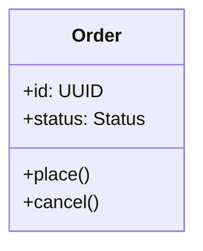

> **Knowledge skill** — Living documentation: what to update, when, how to keep diagrams honest.

# Builder Documentation Duty

Your primary job is code. But living docs are a core output — not a side quest you skip when tired. The next agent inherits what you leave behind. If the docs lie, the next session starts broken.

## What You Maintain

After implementation, these must reflect reality:

```
Changed system shape?     → Update ARCHITECTURE.md
Changed data flow?        → Update or create flow diagram
Changed class structure?  → Update class diagram / ERD
Changed module boundaries?→ Update component diagram
Changed API contracts?    → Update integration docs
Built something new?      → Create living doc near the code
```

If you touched it and the docs don't match, you're not done.

## Diagram Standards

**Formal structure → Mermaid.** Class diagrams, ERDs, sequence diagrams, state machines — anything with strict relationships and types. Mermaid renders cleanly, diffs well, and is parseable.



**Loose structure → ASCII.** Component layouts, data flows, system overviews, dependency arrows — anything showing how things fit together conceptually. ASCII is fast, flexible, and needs no tooling.

```
  Request → Auth → Router → Handler → DB
                              ↓
                           Response
```

**Rule of thumb:** if the diagram has types, fields, or method signatures — Mermaid. If it shows flow, boundaries, or composition — ASCII.

## Plan-to-Reality Reconciliation

Plans are foresight. Living docs are hindsight. Your job is bridging the gap.

As you build, reality diverges from the plan. This is expected. Your duty:

1. **Record the divergence** — update decisions.md with what changed and why
2. **Update the plan** — mark progress, note surprises
3. **Write the truth** — living docs describe what IS, not what was planned

Don't copy the plan into living docs. The plan says "here's what we intended." The living doc says "here's how it works now." Both exist. They tell different stories.

## Scope and Placement

Living docs live near what they describe:

```
design-docs/              → system-level (repo root)
{package}/design-docs/    → package-level
{test-dir}/design-docs/   → test-level
```

Link every new living doc from ARCHITECTURE.md. If it's not linked, future agents won't find it.

## Condense and Expand

Docs evolve. As understanding crystallizes:
- **Condense** — early docs are verbose with context. Once the system stabilizes, tighten. Remove scaffolding prose. Let diagrams carry the weight.
- **Expand** — when you discover non-obvious behavior, document it. The thing that surprised you will surprise the next agent too.
